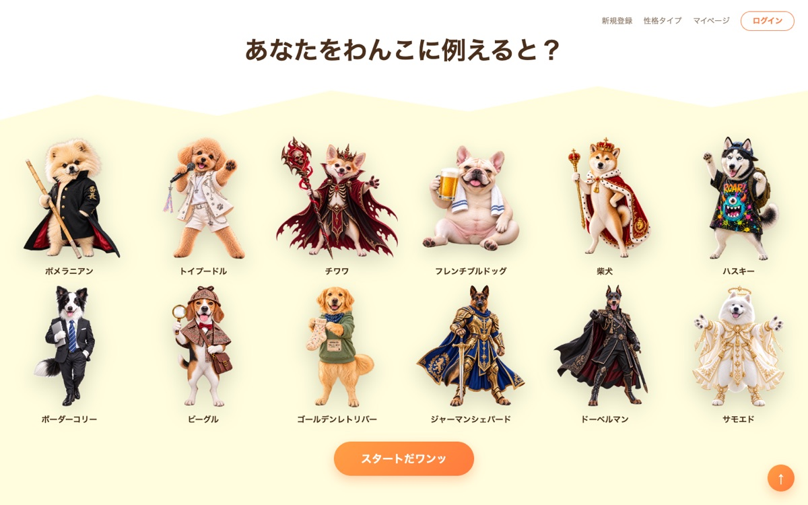
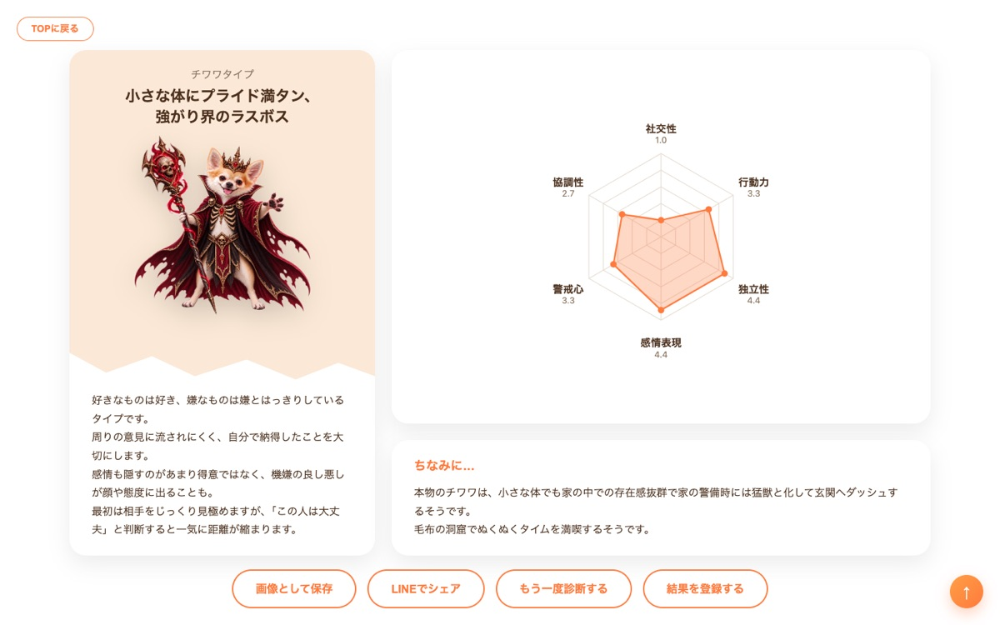
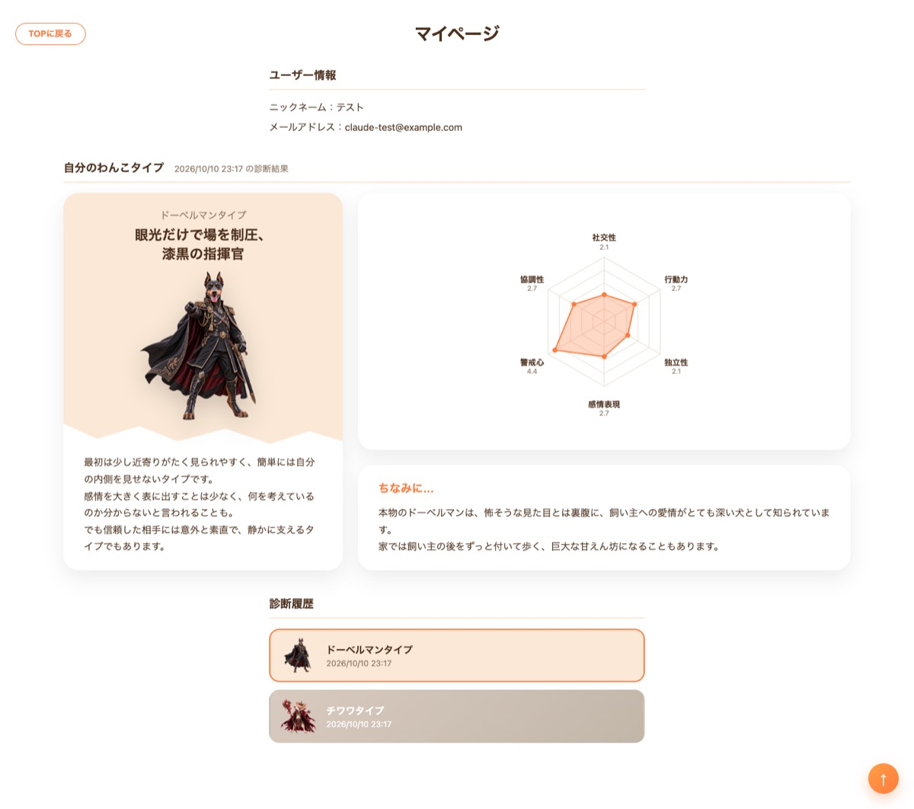
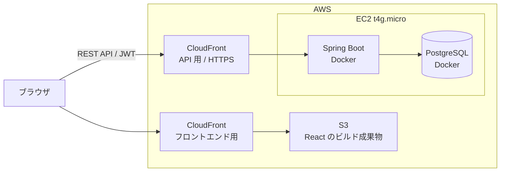

# DogTest（わんこ性格診断）

30問の質問に「はい/いいえ」で答えると、自身の性格を12種類の犬種に例えて診断するWebアプリです。

## 概要

フロントエンドにReact・TypeScript・Vite、バックエンドにJava・Spring Boot、データベースにPostgreSQLを使用して実装した、個人開発のポートフォリオ作品です。

フロントエンドとバックエンドをREST APIでつなぎ、診断ロジックはバックエンド側に持たせています。また、JWTによるログイン機能を実装し、ログイン中のユーザーは診断結果を履歴として保存・確認できます。

開発環境はDocker Composeで構築し、本番環境はAWS（EC2・S3・CloudFront）にデプロイしています。本番のデータベースは、EC2の中でバックエンドと一緒にDockerで動かしています。

https://d330uf5f2vl9lz.cloudfront.net

| TOP画面 | 結果画面 | マイページ |
| --- | --- | --- |
|  |  |  |

以下の画面・機能を実装しています。

- TOP画面（12犬種の一覧表示）
- 診断画面（30問の質問に回答）
- 結果画面（犬種タイプ・6項目のレーダーチャート・解説）
- 診断結果の画像保存
- 診断結果のLINEシェア
- 性格タイプ一覧画面（4グループ・12犬種の紹介）
- 新規登録・ログイン・ログアウト
- マイページ（ユーザー情報・自分のわんこタイプ・診断履歴）
- レスポンシブ対応

## 使用技術

### フロントエンド

- React
- TypeScript
- Vite
- CSS Modules
- [Font Awesome](https://fontawesome.com/)（アイコン）

### バックエンド

- Java 21
- Spring Boot
- Spring Data JPA
- Spring Security
- JWT（jjwt）
- Lombok

### データベース

- PostgreSQL

### インフラ

- Docker / Docker Compose（開発環境）
- AWS EC2（バックエンド・PostgreSQLをDockerで稼働）
- AWS S3 + CloudFront（フロントエンド配信）
- AWS CloudFront（バックエンドAPIのHTTPS化）

## システム構成



## ディレクトリ構成

```text
dog-test/
├── backend/
│   ├── src/main/
│   │   ├── java/com/dogtest/backend/
│   │   │   ├── config/
│   │   │   ├── controller/
│   │   │   ├── dto/
│   │   │   ├── entity/
│   │   │   ├── exception/
│   │   │   ├── repository/
│   │   │   ├── security/
│   │   │   └── service/
│   │   └── resources/
│   │       ├── application.properties
│   │       └── data.sql
│   ├── Dockerfile
│   └── pom.xml
├── frontend/
│   ├── src/
│   │   ├── api/
│   │   ├── assets/
│   │   ├── components/
│   │   ├── screens/
│   │   ├── styles/
│   │   ├── types/
│   │   ├── utils/
│   │   ├── App.tsx
│   │   ├── index.css
│   │   └── main.tsx
│   ├── Dockerfile
│   ├── index.html
│   └── package.json
├── docs/
│   └── aws-deployment.md
├── docker-compose.yml
└── .env.example
```

## 主な機能

### 性格診断

30問の質問に「はい/いいえ」で回答すると、診断結果として12種類の犬種タイプの中から1つを表示します。

質問は「社交性」「行動力」「独立性」「感情表現」「警戒心」「協調性」の6項目に分かれており、選んだ回答ごとに各項目の点数が加算されます。

合計点を1.0〜5.0の値に換算し、あらかじめ設定した12犬種それぞれの6項目の値と比べて、最も近い犬種（ユークリッド距離が最小の犬種）を診断結果としています。

診断ロジックはバックエンド側で処理し、フロントエンドからは回答内容のみをAPIで送信する構成にしています。

### 診断画面

質問は毎回ランダムな順番で表示します。

回答すると、自動で次の質問の位置までスクロールします。

### 結果画面

診断結果の犬種タイプ・キャッチコピー・性格の解説・犬種の豆知識と、6項目の点数をレーダーチャートで表示します。

レーダーチャートは外部ライブラリを使わず、SVGで自作しています。

### 画像保存・LINEシェア

診断結果を画像として保存できます。

html-to-imageで結果カードを画像に変換し、PCでは直接ダウンロード、スマートフォンでは共有シートから写真に保存できるようにしています。

iPhoneのブラウザでは、html-to-imageで描いた画像の中に犬の画像が入らない不具合があったため、犬の画像だけは読み込み完了を待ってからcanvasに直接描き込む方式にしています。

また、LINEのシェア用URLを利用して、診断結果の文章とサイトのURLをLINEでシェアできます。

### 新規登録・ログイン

パスワードはBCryptでハッシュ化してデータベースに保存しています。

ログインに成功するとバックエンドからJWTを発行し、フロントエンド側で保存します。以降のマイページなどのAPIへのアクセス時には、JWTをリクエストに付与してユーザーを認証しています。

新規登録は「テストを受けてから登録する」か「自分のわんこタイプを知っているので犬種を選んで登録する」のどちらかを選べます。

### マイページ

ユーザー情報、自分のわんこタイプ、これまでの診断履歴を表示します。診断日時は日本時間で表示します。

「自分のわんこタイプを知っている」を選んで登録し、まだ診断していない場合は、レーダーチャートの代わりに「診断結果がありません」と表示します。

ログイン中に診断した結果は、自動で診断履歴に保存されます。未ログインで診断した場合も、結果画面から新規登録することで、その結果を登録できます。

### 性格タイプ一覧

12犬種を「フレンドリー」「ムードメーカー」「マイペース」「アクティブ」の4グループに分けて、それぞれの犬種の特徴を紹介しています。

### 画面切り替え

画面の切り替えはReact Routerを使わず、`useState`で現在の画面を管理して切り替えています。

### レスポンシブ対応

TOP画面の犬の一覧は、画面幅に合わせて6列・3列・2列・1列と並び方を変えています。

スマートフォン・タブレットでは犬の一覧が縦に長くなるため、タイトルの下にもスタートボタンを表示しています。

## 工夫した点

### 診断日時のタイムゾーン

診断日時はバックエンドでUTCとして保存し、`2026-10-10T08:50:00Z`のようにUTCであることが分かる形式で返しています。日本時間への変換はブラウザ側で行うため、サーバーのタイムゾーン設定に左右されずに正しい日時を表示できます。

### 本番環境の費用削減

当初はデータベースにRDSを使っていましたが、ポートフォリオの規模に対して費用が大きかったため、EC2の中でバックエンドと一緒にPostgreSQLをDockerで動かす構成に変更しました。データは`pg_dump`で移行しています。

## ローカルでの確認方法

Docker Composeで、フロントエンド・バックエンド・データベースをまとめて起動します。事前にDocker Desktopをインストールしておく必要があります。

```bash
# リポジトリをダウンロード
git clone https://github.com/K-Tsubasa2026/dog-test.git

# フォルダに移動
cd dog-test

# 環境変数ファイルを作成
cp .env.example .env
cp frontend/.env.example frontend/.env
```

作成した`.env`の`POSTGRES_PASSWORD`と`JWT_SECRET`を任意の値に変更します。

`JWT_SECRET`は32バイト以上の値が必要なため、以下のコマンドで生成した値を設定してください。

```bash
openssl rand -base64 32
```

設定後、コンテナを起動します。

```bash
# コンテナをビルドして起動
docker compose up -d --build
```

起動後、以下のURLから確認できます。

```text
http://localhost:5173/
```

バックエンドのAPIは以下のURLで起動します。

```text
http://localhost:8080/
```

## 注意事項

本プロジェクトは個人の学習・ポートフォリオを目的として作成したものです。

診断結果は娯楽を目的としたものであり、心理学的・科学的な根拠に基づくものではありません。

本番環境はAWSの無料プランのクレジットの範囲で運用しているため、予告なく公開を停止する場合があります。商用利用は想定していません。
